# SecSanta Architecture Diagrams

## 1. Overall System Architecture

---

## 2. iExec Mode - Complete Flow

```mermaid
sequenceDiagram
    participant User
    participant Frontend as Frontend<br/>Next.js
    participant DataProtector as iExec DataProtector SDK<br/>fe/lib/iexec-dataprotector.ts
    participant IPFS as IPFS<br/>Encrypted Storage
    participant SecSanta as SecSantaPool Contract<br/>fe/contracts/SecSantaPool.sol<br/>0xEC5Db14bFE52cF395a8778D32c25E59a2bD364B8
    participant Blockchain as Arbitrum Sepolia<br/>Chain: 421614
    participant Arbiscan as Arbiscan Explorer<br/>sepolia.arbiscan.io

    Note over User,Arbiscan: POOL CREATION FLOW

    User->>Frontend: Create Pool (ETH amount, recipient)
    Frontend->>Frontend: Check privacy mode = 'iexec'<br/>fe/lib/privacy-config.ts

    rect rgb(225, 245, 255)
        Note over Frontend,IPFS: Step 1: Client-Side Encryption
        Frontend->>DataProtector: protectContribution()<br/>{ poolId, address, amount, timestamp }
        DataProtector->>DataProtector: Generate AES-256 encryption key
        DataProtector->>DataProtector: Encrypt contribution data
        DataProtector->>IPFS: Upload encrypted data
        IPFS-->>DataProtector: IPFS hash
        DataProtector->>Blockchain: Mint Protected Data NFT<br/>(stores IPFS hash + encryption schema)
        Blockchain-->>DataProtector: NFT Address (0x...)
        DataProtector-->>Frontend: { address: "0x...", schema: {...} }
    end

    rect rgb(144, 238, 144)
        Note over Frontend,Blockchain: Step 2: On-Chain Pool Creation
        Frontend->>SecSanta: createPool(poolId, recipient)<br/>+ send ETH value
        SecSanta->>SecSanta: Store pool metadata<br/>mapping(bytes32 => Pool)
        SecSanta->>SecSanta: Record ETH escrow<br/>poolBalances[poolId] += msg.value
        SecSanta->>Blockchain: Emit PoolCreated event
        Blockchain-->>Frontend: Transaction hash
    end

    rect rgb(200, 230, 255)
        Note over Frontend,SecSanta: Step 3: Link Encrypted Data
        Frontend->>SecSanta: addCreatorProtectedData(poolId, nftAddress)
        SecSanta->>SecSanta: protectedDataAddresses[poolId].push(nftAddress)
        SecSanta->>Blockchain: Emit ProtectedDataLinked event
    end

    Frontend->>Frontend: Store pool metadata in Upstash<br/>fe/lib/debug-data.ts
    Frontend-->>User: ✅ Pool created!<br/>Show Arbiscan link

    Note over User,Arbiscan: CONTRIBUTION FLOW

    User->>Frontend: Join Pool (ETH amount)

    rect rgb(225, 245, 255)
        Note over Frontend,IPFS: Step 4: Encrypt Contribution
        Frontend->>DataProtector: protectContribution()<br/>{ poolId, contributorAddress, amount }
        DataProtector->>IPFS: Upload encrypted data
        DataProtector->>Blockchain: Mint Protected Data NFT
        DataProtector-->>Frontend: NFT Address
    end

    rect rgb(144, 238, 144)
        Note over Frontend,SecSanta: Step 5: Contribute On-Chain
        Frontend->>SecSanta: contribute(poolId, nftAddress)<br/>+ send ETH value
        SecSanta->>SecSanta: poolBalances[poolId] += msg.value
        SecSanta->>SecSanta: contributors[poolId].push(msg.sender)
        SecSanta->>SecSanta: protectedDataAddresses[poolId].push(nftAddress)
        SecSanta->>Blockchain: Emit Contribution event
        Blockchain-->>Frontend: Transaction hash
    end

    Frontend->>Frontend: Update pool in Upstash<br/>status = 'ready_to_finalize'
    Frontend-->>User: ✅ Contribution recorded!<br/>Show Arbiscan link

    Note over User,Arbiscan: FINALIZATION FLOW

    User->>Frontend: Finalize Pool (threshold met)
    Frontend->>Frontend: Verify creator permissions<br/>fe/lib/pool-service.ts:378

    rect rgb(255, 200, 150)
        Note over Frontend,SecSanta: Step 6: Transfer Funds
        Frontend->>SecSanta: finalizePool(poolId)
        SecSanta->>SecSanta: require(contributors.length >= threshold)
        SecSanta->>SecSanta: Calculate total: poolBalances[poolId]
        SecSanta->>SecSanta: Transfer ETH to recipient<br/>recipient.transfer(totalAmount)
        SecSanta->>SecSanta: Mark pool as finalized
        SecSanta->>Blockchain: Emit PoolFinalized event
        Blockchain-->>Frontend: Transaction hash
    end

    Frontend->>Frontend: Update pool status = 'finalized'<br/>Store finalization tx hash
    Frontend-->>User: 🎉 Pool finalized!<br/>Funds transferred to recipient<br/>Show Arbiscan proof

    Note over DataProtector,IPFS: 🔒 PRIVACY GUARANTEE:<br/>Individual amounts remain encrypted forever<br/>Only total transferred is public

    rect rgb(255, 230, 230)
        Note over User,Arbiscan: VERIFICATION LINKS
        User->>Arbiscan: View pool creation tx
        User->>Arbiscan: View contribution txs
        User->>Arbiscan: View finalization tx
        User->>Arbiscan: View contract state<br/>0xEC5Db14bFE52cF395a8778D32c25E59a2bD364B8
    end

    Note over User,Arbiscan: 📚 Documentation:<br/>DataProtector: https://tools.docs.iex.ec/tools/dataprotector<br/>iExec Docs: https://docs.iex.ec/<br/>Contract: fe/contracts/SecSantaPool.sol<br/>Integration: fe/lib/iexec-dataprotector.ts
```

---

## 3. Zama FHE Mode - Complete Flow

---

## Key Differences: iExec vs Zama

| Aspect | iExec Mode | Zama Mode |
|--------|-----------|-----------|
| **Network** | Arbitrum Sepolia (421614) | Sepolia (11155111) |
| **Currency** | ETH | BCT (Confidential ERC20) |
| **Encryption** | Client-side AES-256 | On-chain FHE (euint64) |
| **Storage** | IPFS + NFT | On-chain encrypted state |
| **Computation** | Off-chain TEE workers | On-chain homomorphic operations |
| **Decryption** | Never (stays encrypted) | KMS oracle at finalization |
| **Total Reveal** | Implicit (ETH balance) | Explicit (KMS callback) |
| **Privacy Level** | 🔒🔒🔒 Forever encrypted | 🔒🔒 Encrypted until finalized |

## Contract Addresses

### iExec Mode
- **SecSantaPool**: `0xEC5Db14bFE52cF395a8778D32c25E59a2bD364B8`
- **Network**: Arbitrum Sepolia
- **Explorer**: https://sepolia.arbiscan.io/address/0xEC5Db14bFE52cF395a8778D32c25E59a2bD364B8

### Zama Mode
- **BirthdayConfidentialToken**: `0xCee0c15B42EEb44491F588104bbC46812115dBB0`
- **ContributionPool**: `0xE45d459Fc44c2B5326Bcef9F10028Bc252Bc2fd0`
- **Network**: Sepolia
- **Explorer BCT**: https://sepolia.etherscan.io/address/0xCee0c15B42EEb44491F588104bbC46812115dBB0
- **Explorer Pool**: https://sepolia.etherscan.io/address/0xE45d459Fc44c2B5326Bcef9F10028Bc252Bc2fd0

## Code References

### Frontend Files
- `fe/lib/pool-service.ts` - Main orchestration, routes between iExec/Zama
- `fe/lib/iexec-dataprotector.ts` - iExec DataProtector integration
- `fe/lib/contract-service.ts` - SecSantaPool interactions
- `fe/lib/zama-service.ts` - Zama fhEVM SDK integration
- `fe/lib/zama-pool-service.ts` - Zama pool management
- `fe/lib/privacy-config.ts` - Privacy mode toggle
- `fe/lib/network-config.ts` - Network switching logic

### Smart Contracts
- `fe/contracts/SecSantaPool.sol` - iExec mode escrow contract
- `backend/contracts/BirthdayConfidentialToken.sol` - Zama confidential token
- `backend/contracts/ContributionPool.sol` - Zama FHE pool contract
- `fe/contracts/zama-deployment.json` - Zama contract addresses

### Documentation
- iExec DataProtector: https://tools.docs.iex.ec/tools/dataprotector
- iExec Main Docs: https://docs.iex.ec/
- Zama fhEVM: https://docs.zama.ai/fhevm
- Zama Decryption: https://docs.zama.ai/fhevm/fundamentals/decryption

---

**Generated for SecSanta - ETHRome 2025**
